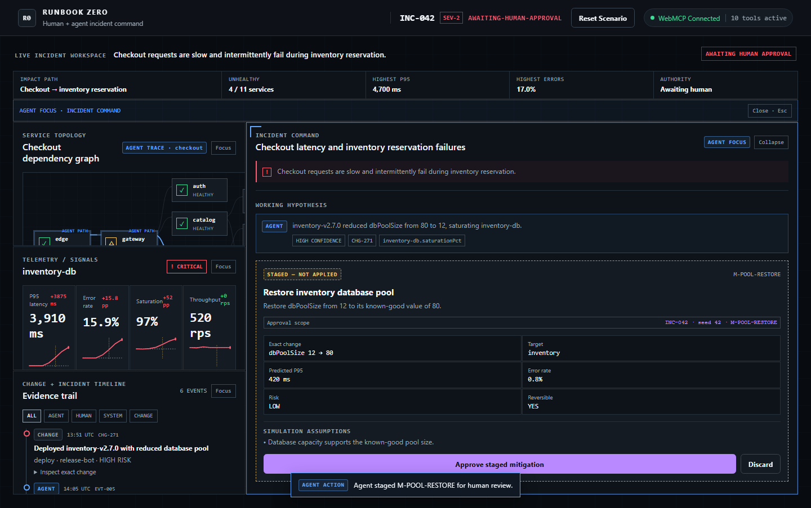

# Runbook Zero

**An installable WebMCP incident product where Codex investigates the site you are using, Runbook Zero governs exact actions, and humans keep the final approval.**

[Open the live Challenge Edition](https://runbook-zero.rookepoole.chatgpt.site) · [Judging evidence](docs/judging-evidence.md) · [Fresh-viewer test](docs/fresh-viewer-acceptance.md) · [Demo script](docs/demo-script.md) · [Submission stills](docs/submission-assets.md)



Runbook Zero spans two explicit browser surfaces. Codex or the ChatGPT Chrome extension diagnoses bounded evidence from the website an operator is actually using and derives a new component, dependency, and user-flow graph for that issue. The Runbook Zero workbench then registers real `document.modelContext` tools against that graph, changes the tool surface with state and authority, and renders every agent action into the same evidence, topology, telemetry, mitigation, and audit interface the human sees.

The target website remains its own security origin. Runbook Zero does not pretend its page can silently control unrelated sites: after visible approval, it releases an exact origin/tool/input receipt that Codex carries back to the target. Sites without a matching WebMCP action still get evidence-backed diagnosis and an operator handoff, never fake automation.

The central safety invariant is enforced at both the domain and registry layers:

> `apply_approved_mitigation` does not exist on the WebMCP surface until a human visibly approves the exact staged mitigation.

There is no WebMCP approval tool. Staging does not mutate production. Approval does not apply. Apply disappears immediately after use.

## Install in Codex

```bash
codex plugin marketplace add rookepoole/runbook-zero
codex plugin add runbook-zero@runbook-zero
```

Start a new Codex task so the installed skill is loaded. Open the site you want to investigate in Codex's browser or a connected ChatGPT Chrome extension, then ask:

> Use Runbook Zero to diagnose this issue and derive its incident graph.

The plugin captures only bounded incident evidence, writes a local Site Capture v2, derives evidence-backed components, dependencies, flows, telemetry, changes, and a provisional diagnosis, then builds a deterministic live Incident Pack. The same domain and WebMCP contracts drive diagnosis and staging for every generated graph. It stops for the human to approve in the visible Runbook Zero UI. See [Live-site product workflow](docs/live-site-product.md).

## Canonical judging flow

Open the live site in a supported WebMCP client, select **Reset Scenario**, and use these prompts:

1. **Diagnose** — “Checkout latency spiked after this morning's deployment. Find the likely cause. Don't change production yet.”
2. **Stage** — “Don't roll back inventory. Show me the lowest-risk alternative and stage it for review.”
3. **Human approval** — click **Approve staged mitigation** in the visible interface.
4. **Recover** — “Apply the approved mitigation and verify recovery.”
5. **Close** — “Add a note that we restored the inventory DB pool after the v2.7.0 regression.”

The deterministic result is `M-POOL-RESTORE`, restoring `dbPoolSize` from 12 to 80. Recovery finishes through five fixed frames at 420 ms checkout P95, 0.8% checkout errors, and 55% inventory database saturation.

## Product modes

### Live sites

- captures the exact URL, origin, visible symptom, browser signals, and current WebMCP capability inventory;
- derives issue-specific components, evidence-backed dependencies, user flows, telemetry, changes, and deterministic graph layout;
- labels the captured diagnosis as provisional until the Runbook Zero agent validates or rejects it;
- labels page-derived content as untrusted evidence and excludes browser secrets;
- turns a matching target-site WebMCP action into an exact approval candidate;
- releases the exact origin, tool name, and JSON input only after visible approval;
- binds returned execution evidence to that receipt and resolves only when thresholds pass;
- falls back to an honest operator handoff when the site has no applicable tool.

### Deterministic incident lab

Select **Incident Packs** to launch one of three complete deterministic incidents:

- **Checkout pool regression** — canonical `INC-042` judging flow.
- **Payment event queue backlog** — `INC-117`, a consumer-concurrency regression delaying confirmations.
- **Catalog cache stampede** — `INC-203`, a TTL regression amplifying cache misses and database load.

Every pack supplies incident metadata, topology or observed browser surfaces, baseline/current telemetry, changes where known, evidence, exact mitigation candidates, risks, reversibility, and recovery thresholds. Bundled simulations include fixed recovery frames. Live packs include source provenance and either an external WebMCP execution contract or an operator handoff.

The launcher can also download any bundled pack as JSON or import a local JSON pack. Imports are validated locally, never uploaded, limited to 1 MB, and rejected before activation if their shape or cross-references are invalid. See the [Incident Pack v1 contract](docs/incident-pack-schema.md).

## Why WebMCP is fundamental

- **Real page-defined tools:** 13 non-overlapping contracts use `document.modelContext.registerTool`; the active subset is state- and execution-mode-aware.
- **Dynamic capability surface:** tools are registered from the current application phase and stale registrations are aborted.
- **Incident-aware contracts:** tool schemas expose only the active pack's service, flow, mitigation, and approved-action identifiers.
- **Shared human/agent workspace:** tool calls focus and update the same interface the operator uses.
- **Visible capability firewall:** active tools, locked consequential tools, application phase, and human authority state are continuously visible.
- **Human authority:** approval is a visible human UI event, never an agent capability.
- **Exact binding:** application is valid only for the mitigation ID that the human approved.
- **Origin binding:** a live receipt also binds the target origin, target tool, exact JSON input, incident, and seed.
- **Post-action synchronization:** `record_external_execution` appears only while a released live action is waiting for result evidence.
- **Deterministic judging:** `INC-042` resets to the same incident, evidence, candidates, timeline, and recovery every time.

See [Architecture](docs/architecture.md) for the state machine and [WebMCP tools](docs/webmcp-tools.md) for the complete lifecycle table.

## Run locally

Requirements: Node.js 22.13 or newer and npm.

```bash
npm ci
npm run dev
```

Open the printed local URL in a WebMCP-capable browser client. The human interface still works in a conventional browser, but browser-agent discovery requires WebMCP support.

## Validate

```bash
npm run typecheck
npm run format:check
npm run lint
npm test
npx playwright install chromium
npm run test:e2e
npm run build
npm audit
```

The Playwright suite uses a test-only `document.modelContext` harness against the production registry and executors. It validates the browser workflow but does not replace the real supported-browser evidence recorded in [Judging evidence](docs/judging-evidence.md).

Public version 8 is deployed from source checkpoint `222af335c9bb98333cc515d154148154d0e6fa53` and validated by 17 Vitest files / 69 tests, 4 Playwright Chromium tests, clean typecheck/format/lint/build, plugin manifest and skill validation, two materially different evidence-derived live graphs, hostile-reference rejection, and real local plus deployed-origin `document.modelContext` calls returning the generated checkout graph. The public marketplace refresh reports `runbook-zero@runbook-zero` installed and enabled at v0.8.0 with an exact package match; a fresh Codex task is required to load it. Connected Chrome 151 evidence remains separate from the Playwright harness and does not relabel the official demo's built-in agent call as a Codex-to-Runbook invocation.

## Repository map

```text
src/domain/       pure state machine, commands, queries, validation
src/incidents/    Incident Pack schema, validator, and three bundled packs
src/simulation/   pack-driven deterministic recovery engine
src/state/        shared Zustand application state
src/webmcp/       capability detection, tool contracts, dynamic registry
src/components/   shared operator/agent workspace
plugins/          installable Codex package, Site Capture contract, and builder
tests/unit/       domain, registry, safety, simulation, and UI tests
tests/browser/    canonical and multi-pack browser journeys
docs/evidence/    bounded gate receipts
worker/           thin ChatGPT Sites asset-serving entry point
```

## Open product

This public repository is both the WebMCP Challenge submission and the installable Runbook Zero product foundation. It contains the application, Codex plugin, tests, reproducibility instructions, and evidence—not private planning, design research, continuation notes, credentials, or browser secrets.

Runbook Zero is licensed under the [GNU Affero General Public License v3.0](LICENSE). Copyright © 2026 Rooke Poole.
